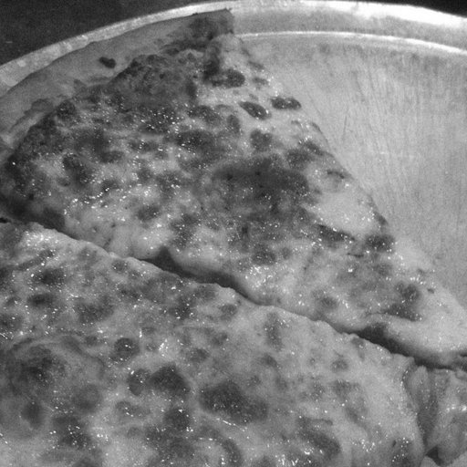
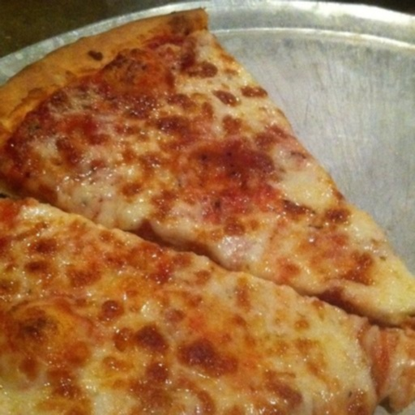
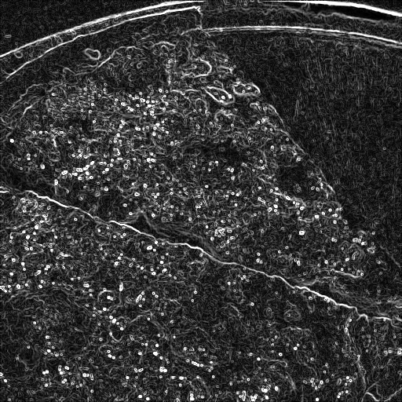
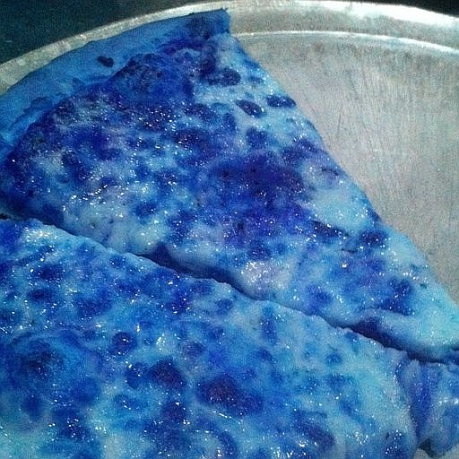

# CST435: Parallel Image Processing on GCP

A system that applies 5 image filters to Food-101 photos using two parallel programming paradigms:

1. `multiprocessing.Pool`
2. `concurrent.futures.ProcessPoolExecutor`

## GCP Deployment

### 1. Create VM Instance

- **Machine Type**: e2-standard-4 (4 vCPU, 16GB RAM)
- **Boot Disk**: 50GB, Ubuntu 22.04 LTS
- **Firewall**: Allow HTTP/HTTPS traffic

### 2. Setup Commands (GCP SSH)

```bash
# Update system
sudo apt update && sudo apt upgrade -y
sudo apt install -y python3 python3-pip python3-venv git

# Clone and setup
git clone https://github.com/Lithia22/CST435.git
cd CST435
python3 -m venv venv
source venv/bin/activate
pip install -r requirements.txt
```

### 3. Dataset Preparation

#### **Method 1: Use Included Dataset**

The repository includes 200 Food-101 images. No setup needed.

#### **Method 2: Download via Kaggle API (Optional)**

If you want to download additional images:

1. **Setup Kaggle API** (one-time):

```bash
# Create account at https://www.kaggle.com
# Go to Settings → API → Create New Token
# Download kaggle.json
mkdir -p ~/.kaggle
mv ~/Downloads/kaggle.json ~/.kaggle/
chmod 600 ~/.kaggle/kaggle.json
```

2. **Download dataset**:

```bash
python download_dataset.py
```

### 4. Final Execution

```bash
# Run the program
python main.py
```

### 5. Download Results from GCP

After running `python main.py`, the program automatically creates `results.zip`:

1. In SSH window: Click **"Download file"**
2. Enter path: `/home/username/CST435/results.zip`
3. Click **"Download"** and extract on your computer

## Filtered Results

|             Original Image             |                         Grayscale                          |                        Gaussian Blur                        |                     Edge Detection                      |                        Image Sharpening                         |                   Brightness Adjustment                    |
| :------------------------------------: | :--------------------------------------------------------: | :---------------------------------------------------------: | :-----------------------------------------------------: | :-------------------------------------------------------------: | :--------------------------------------------------------: |
|  |  |  |  |  |  |

**Note**: These are sample outputs. Your actual results will be in `results/` folder.

## Group Members

- **Lithia A/P Kisnen** - 163850
- **Tejashree Laxmi A/P Kanthan** - 163506
- **Dershyani A/P B.Thessaruva** - 164062
- **Kavitashini A/P Seluvarajoo** - 164329
